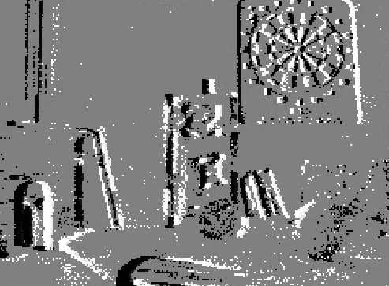

My solutions to exercises from Prof. Guillermo Gallego's course ["Event-based Robot Vision"](https://sites.google.com/view/guillermogallego/teaching/event-based-robot-vision), from Technical University Berlin (TUB).

Details of the exercises are as follow:

1. A simple introduction to image processing with OpenCV in python; code in `imgproc_py` directory. 
2. A notebook containing visualisations of many common representations of event data; code in the `events_viz` directory.
3. A ROS node for visualising event data as either: brightness-increment images, or overlaid over color frame. Quite similar in functionality to the `dvs_renderer` package from [rpg_dvs_ros](https://github.com/uzh-rpg/rpg_dvs_ros/). My package can be found in `evis_ws/src/dvs_displayer`.
4. An implementation of Cedric Scheerlinck et al.'s [paper](https://arxiv.org/abs/1811.00386/) to reconstruct images from events asynchronously, visualised in the GIF above. My package can be found in `evis_ws/src/dvs_integrator`.
5. An extension to the previous, focused on implementing asynchronous spatial convolution of event data and subsequent reconstruction. My package can be found in `evis_ws/src/dvs_integrator_conv`.
6. A ROS node for computing a global optical flow vector for the image, by contrast maximisation. This node is implemented in Python to allow me to prototype faster, but a C++ node maybe developed later on. Note while building the workspace to **NOT** use the `--symlink-install` option as it fails and breaks the workspace due to the `ament_cmake_python` build tool. Use the `clean_build.bash` script in case your build breaks.
7. Not started yet

The solutions for exercises 3 to 5 (`evis_ws`) are implemented in ROS2, as opposed to the professor's provided code in ROS1. To ensure compatibility, I've ported the `dvs_msgs` package from the RPG's [rpg_dvs_ros](https://github.com/uzh-rpg/rpg_dvs_ros) repo. To convert any ROS1 bag, including the one used in this exercise, to ROS2, install the `rosbags` library from pip and convert it using the following command (ensuring the executable is in your path):

```bash
rosbags-convert --src <ros1_bag_name>.bag --dst <ros2_bag_folder name>
```

To run this bag, you must ensure to source the workspace containing `dvs_msgs`. Example instructions for the bag I used are as follows:

```bash
cd evis_ws
./clean_build.bash # script to build dvs_msgs first
source install/setup.bash
wget http://rpg.ifi.uzh.ch/datasets/davis/slider_depth.bag
rosbags-convert --src slider_depth.bag --dst slider_depth_ros2
ros2 bag play -l slider_depth_ros2/slider_depth_ros2.db3
```

<!-- The code has been tested on Ubuntu 22.04 with ROS Humble and python3.10, and the jupyter notebooks with python2.7. The dependencies for the python ROS nodes can be installed through `requirements.txt`, preferably in a virtual environment -->

My notes on the course, and more, can be found on my [website](https://abban-fahim.github.io/notes/notes/robotics/computer-vision/). 